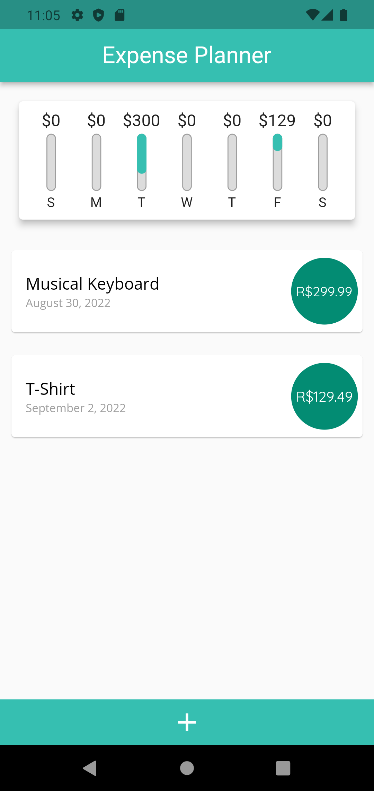
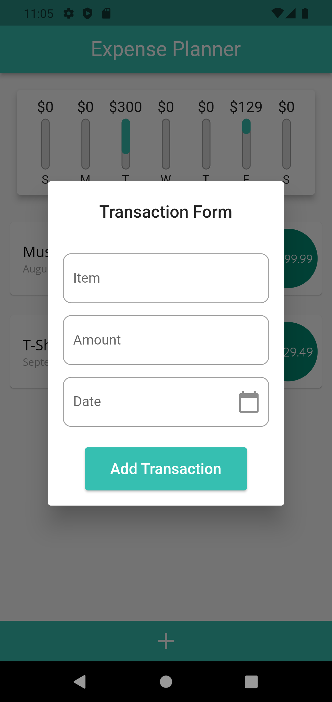
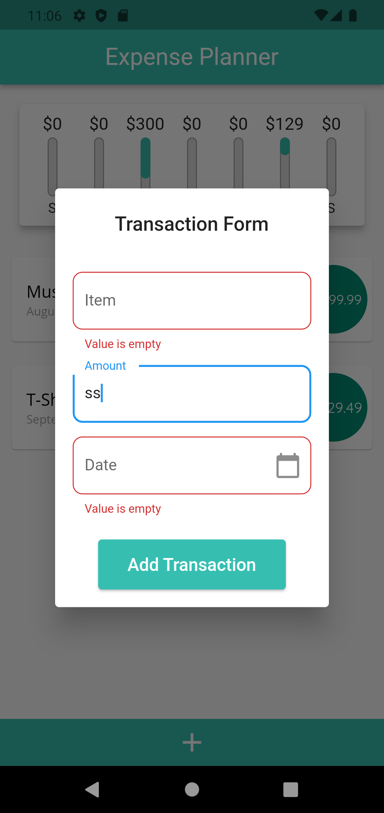
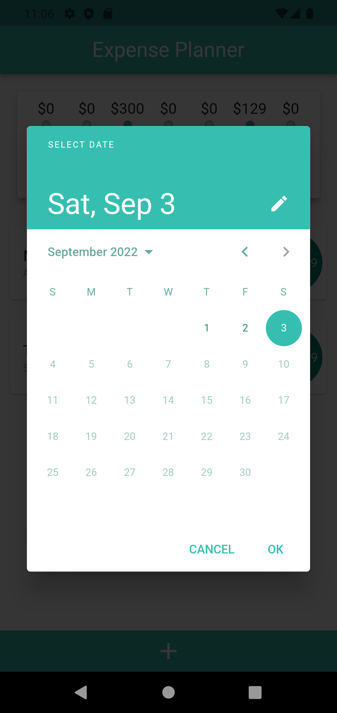
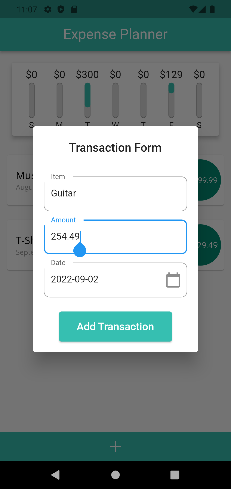
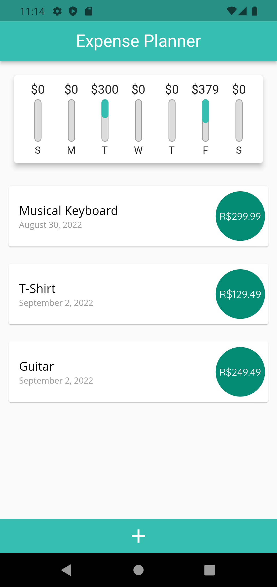

# STUDY_EXPENSE-PLANNER

Um projeto desenvolvido para concluir o curso <a href="https://www.udemy.com/course/learn-flutter-dart-to-build-ios-android-apps/" alt="Link to course" target="_blank">Flutter & Dart - The Complete Guide [2022 Edition]</a>

Sua função principal é gerenciar as compras do usuário. Estão inclusos as funções de: 
- criar uma transação (clicar no botar +)
- validação de formulário
- remover uma transação (arrastar para o lado)
- visualizar lista de transações
- visualizar lista de gastos nos últimos 7 dias

Observações adicionais:
- em landscape somente é possível ver um dos dois: ou a lista ou o chart

## PICTURES

   

  

## Built With

As principais dependências utilizadas no projeto e padrões de organização de pastas

* <a href="https://pub.dev/packages/provider" alt="Link to Provider docs">Provider</a>: solução para state management

## TODO

- [ ] Implementar firebase ou local_storage para a base de dados
- [ ] Editar transação
